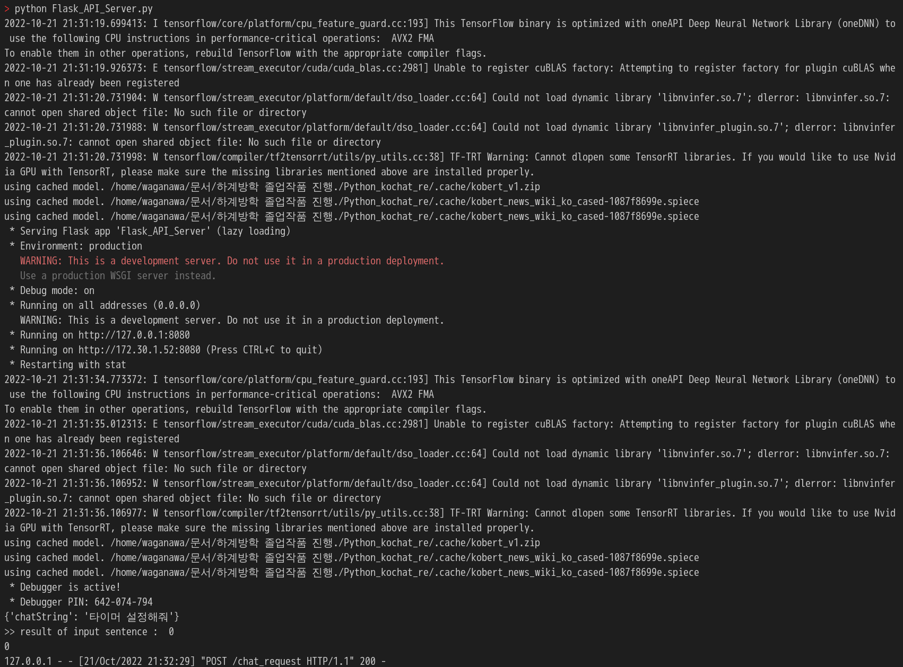

# 제목 없음

Created: 2022년 10월 21일 오후 9:38
Last Edited Time: 2022년 10월 21일 오후 10:00

## Graduation Chatbot AI Model and API Server Module

> The code for this chatbot AI module and API server module is the result of borrowing and modifying the code for the open source kochat project.
> 

[https://github.com/hyunwoongko/kochat](https://github.com/hyunwoongko/kochat)

---

### **Implementation of temporary functions**

<aside>
💡 Currently, only minimal user sentence content discrimination is supported for demo support.

1. **Current Support Features**
    1. model : intent_classification
        
        
        | TIMER | NEXT | BEFORE | REPEAT |
        | --- | --- | --- | --- |
        | 0 | 1 | 2 | 3 |
2. **Future Support Features**
    1. NER Support (entent classification)
        1. **Error occurred and some code implementation contents are being corrected**
</aside>

---

### API Server Runner:

pre_trained_model for intent classification :

[KoBERT_Intent_model.pt](https://drive.google.com/file/d/10LuaJNhYzg50p2n_GwTvPLmq8wQTxSIV/view?usp=sharing)

> Share Google Drive for GitHub File Capacity Limits
> 

### how to run server :

run command : python Flask_API_Server.py

<aside>
➡️ server running result :



Img of Server command_line 

qury : 

http post protocol : 

entry_point : /chat_request

body : JSON 

Example :

```jsx
{"chatString":"타이머 설정해줘"}
```

### **ideal return result**

```jsx
{
    "chatString": "타이머 설정해줘",
    "intent": "0"
}
```

</aside>

requirements :

pip install git+https://git@github.com/SKTBrain/KoBERT.git@master

pip install konlpy

pip install seqeval

pip install pytorch-crf

pip install gensim